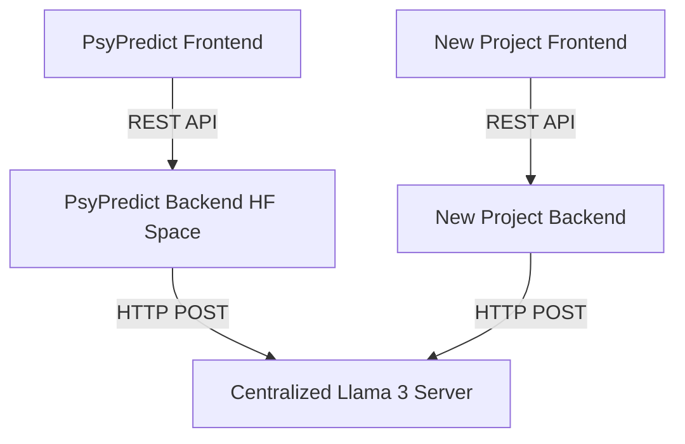

# Centralized Llama 3 AI Microservice Architecture

This guide explains how to properly host a Llama 3 AI model to serve multiple applications (like PsyPredict and your future projects) without crashing your application backends due to Out-Of-Memory (OOM) errors.

## The Problem
Running a large language model (like Llama 3 8B) requires significant RAM (minimum 8-16GB just for the model). When combined with other ML models (like DistilBERT for text emotion and a CNN for facial emotion) inside a constrained environment like a Free Hugging Face Space, the server crashes when handling requests. Furthermore, duplicating the model across multiple projects is highly inefficient.

## The Solution: A Dedicated AI Microservice
Instead of putting the massive 5GB+ Llama 3 model inside every project's backend, deploy Llama 3 **once** as a standalone, centralized API server. Both PsyPredict and your new project can then make lightweight network requests to this single server.



## Option 1: Dedicated Virtual Private Server (VPS) via Ollama (Recommended)
This is the most stable and professional approach. You rent a cheap cloud server (e.g., DigitalOcean, Hetzner, AWS EC2, or a RunPod GPU instance) and run the official Ollama Docker container.

### Step-by-Step Setup
1. **Provision a Server:** Rent a Linux VPS with at least 8GB (preferably 16GB) of RAM, or a cheap GPU server.
2. **Install Docker:** Follow the official Docker installation guide for your Linux distribution.
3. **Run Ollama Container:**
   ```bash
   # Run the Ollama server in a Docker container
   docker run -d -v ollama:/root/.ollama -p 11434:11434 --name ollama ollama/ollama
   ```
4. **Download the Model (Run Once):**
   ```bash
   # Execute a command inside the container to pull the model
   docker exec -it ollama ollama run llama3
   ```
5. **Network Configuration:** Ensure your server's firewall allows inbound traffic on port `11434` (or set up a reverse proxy with Nginx for security/HTTPS).
6. **Deploy PsyPredict:** In your PsyPredict backend environment variables (e.g., in Hugging Face), set:
   ```env
   OLLAMA_BASE_URL=http://<YOUR_VPS_IP_ADDRESS>:11434
   USE_EMBEDDED_LLM=False
   ```

## Option 2: Dedicated Hugging Face Space API
If you prefer not to manage a VPS and want to stay within the Hugging Face ecosystem (Note: This still requires a paid Space upgrade to get enough RAM/GPU for Llama 3 to run without crashing).

### Step-by-Step Setup
1. **Create a New Space:** Create a new Hugging Face Docker Space named `My-Central-Llama-API`.
2. **Create the API Code (`main.py`):**
   ```python
   from fastapi import FastAPI
   from pydantic import BaseModel
   from llama_cpp import Llama

   app = FastAPI()
   
   # Load model on startup (Requires the .gguf file downloaded via Hugging Face Hub)
   llm = Llama(model_path="llama-3-8b-instruct.Q4_K_M.gguf", n_ctx=4096)

   class ChatRequest(BaseModel):
       prompt: str

   @app.post("/generate")
   def generate(req: ChatRequest):
       response = llm(prompt=req.prompt, max_tokens=1024)
       return {"response": response["choices"][0]["text"]}
   ```
3. **Create a `Dockerfile`:** Include instructions to install `fastapi`, `uvicorn`, `llama-cpp-python`, and a script to download the GGUF model file.
4. **Deploy PsyPredict:** Update your PsyPredict `ollama_engine.py` to point to the URL of this new Hugging Face Space.

## Why You Shouldn't Store the Model in GitHub
Do **not** attempt to commit the 5GB+ `.gguf` file to your GitHub repository. GitHub has strict file size limits. 
Always let your deployment environment (Docker container, HF Space, VPS) download the model directly from the Hugging Face Hub during the build or initialization phase.
