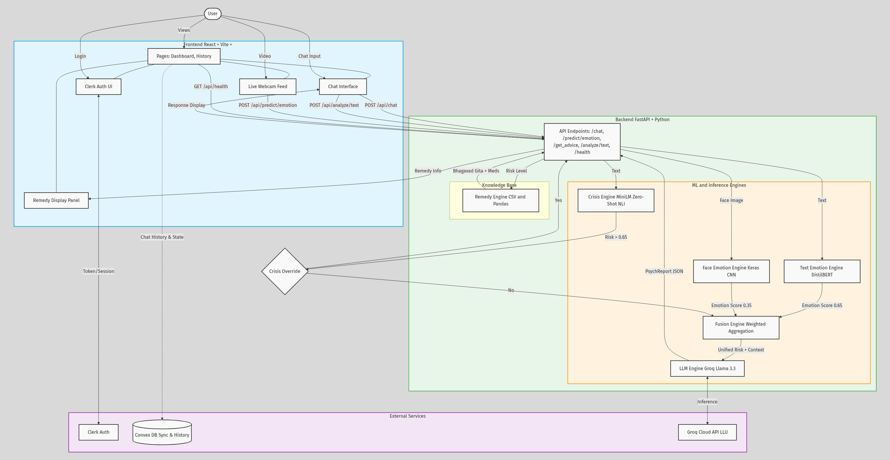
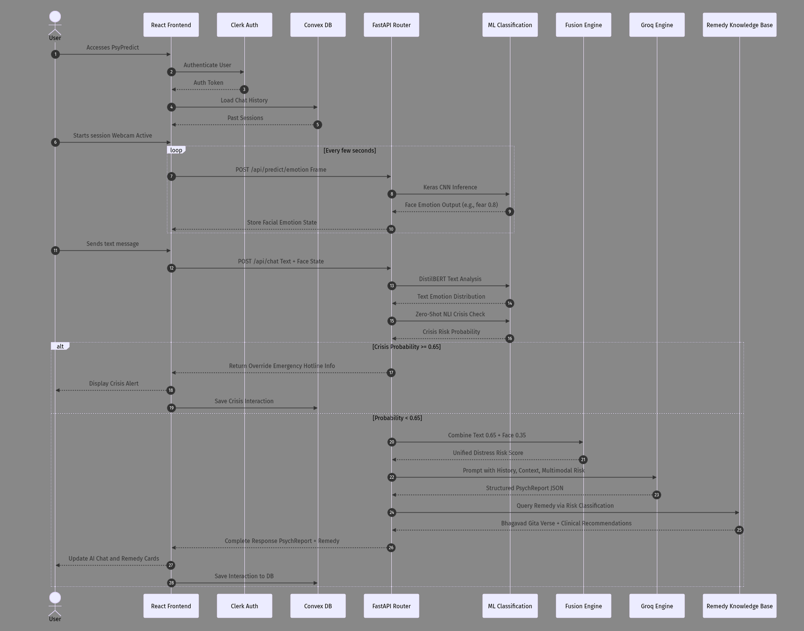

# 🧠 PsyPredict
> *Production-Grade Multimodal Clinical AI System*


---

## Overview

**PsyPredict** is a fully production-grade multimodal mental health AI system. It combines:

- **DistilBERT** multi-label text emotion classification
- **Llama 3** via **Groq API** (cloud, default) or **Ollama** (local) for structured clinical reasoning
- **Keras CNN** facial emotion detection (live webcam)
- **Zero-shot NLI** crisis detection with automatic override
- **Weighted multimodal fusion** for a combined distress risk score
- **Bhagavad Gita** remedy system — culturally grounded guidance from CSV knowledge base

Every AI response returns a structured **PsychReport** — not a generic chatbot reply.

---

## Key Features

### 1. Multimodal Emotion Understanding
- **Facial Analysis:** Keras CNN detects live emotions via webcam (7 classes)
- **Text Analysis:** DistilBERT classifies multi-label emotions from user text
- **Weighted Fusion:** `(Text × 0.65) + (Face × 0.35)` → unified distress score

### 2. Clinical-Grade Output (PsychReport)
Every chat response includes:
- `risk_classification` — MINIMAL / LOW / MODERATE / HIGH / CRITICAL
- `emotional_state_summary` — concise, grounded assessment
- `behavioral_inference` — inferred patterns from conversation
- `cognitive_distortions` — CBT distortion labels detected
- `suggested_interventions` — clinically actionable recommendations
- `confidence_score` — LLM self-assessed confidence

### 3. Crisis Detection Layer
- Zero-shot NLI classification across 5 risk dimensions (NOT keyword matching)
- Weighted risk scoring — triggers at configurable threshold (default: 0.65)
- **Overrides LLM** — deterministic crisis response with emergency hotlines (iCall, Vandrevala, AASRA)

### 4. Bhagavad Gita Remedy System
- CSV-based remedy lookup matched to detected risk level
- Gita wisdom quote + medications + dosage + recommended treatments
- Displayed as a collapsible panel alongside the clinical report

### 5. Production Hardened
- Input sanitization (HTML strip, 2000-char limit)
- Retry with exponential backoff on Groq failures
- Graceful fallback when Groq API key missing or unreachable
- Rate limiting (30 req/min)
- Structured logging
- Pydantic validation on all I/O
- Context window trimming (last 10 turns)

---

## System Architecture

### Pipeline


### Application Workflow


---

## Tech Stack

| Component | Technology |
|-----------|-----------|
| **Frontend** | React, Vite, TypeScript, TailwindCSS |
| **Backend** | Python, FastAPI, Uvicorn |
| **LLM** | Llama 3 via Groq API (cloud) or Ollama (local) |
| **Text Emotion** | DistilBERT (`bhadresh-savani/distilbert-base-uncased-emotion`) |
| **Crisis Detection** | MiniLM Zero-Shot NLI |
| **Face Emotion** | OpenCV + Custom Keras CNN |
| **Auth** | Clerk |
| **Database** | Convex (conversation history) |
| **Remedies** | Pandas + CSV knowledge base |
| **Hosting** | HF Spaces (backend) · Vercel (frontend) |

---

## Folder Structure

```
PsyPredict/
├── backend/
│   ├── app/
│   │   ├── main.py                    # FastAPI app + lifespan
│   │   ├── config.py                  # Pydantic Settings (GROQ_API_KEY etc.)
│   │   ├── schemas.py                 # PsychReport + all API models
│   │   ├── ml_assets/
│   │   │   ├── emotion_model_trained.h5
│   │   │   ├── haarcascade_frontalface_default.xml
│   │   │   └── MEDICATION.csv
│   │   ├── services/
│   │   │   ├── base_llm_client.py    # Abstract LLM interface
│   │   │   ├── groq_client.py        # Groq cloud API client
│   │   │   ├── ollama_client.py      # Ollama local HTTP client
│   │   │   ├── llm_provider.py       # Factory — resolves LLM_PROVIDER
│   │   │   ├── llm_shared.py         # Shared prompt & parsing
│   │   │   ├── ollama_engine.py      # Backwards-compatible shim
│   │   │   ├── text_emotion_engine.py # DistilBERT text emotion
│   │   │   ├── crisis_engine.py       # Zero-shot NLI crisis detection
│   │   │   ├── fusion_engine.py       # Multimodal weighted fusion
│   │   │   ├── emotion_engine.py      # Keras CNN face emotion
│   │   │   └── remedy_engine.py       # CSV remedy lookup
│   │   └── api/endpoints/
│   │       ├── therapist.py           # POST /api/chat
│   │       ├── facial.py              # POST /api/predict/emotion
│   │       ├── remedies.py            # GET  /api/get_advice
│   │       └── analysis.py            # POST /api/analyze/text
│   ├── Dockerfile
│   ├── requirements.txt
│   └── .env.example
├── frontend/
│   ├── src/
│   │   ├── components/features/
│   │   │   ├── ChatInterface.tsx      # Chat + combined Clinical+Remedy panel
│   │   │   ├── WebcamFeed.tsx         # Live webcam emotion feed
│   │   │   └── RemedyCard.tsx         # Standalone Gita remedy card
│   │   ├── services/api.ts            # Typed API client
│   │   └── pages/
│   │       ├── Dashboard.tsx
│   │       └── History.tsx
│   └── package.json
├── DEPLOY.md                          # Full deployment guide
├── OLLAMA_VPS_GUIDE.md               # Self-hosted Ollama fallback guide
└── INSTRUCTIONS.md
```

---

## Getting Started (Local Development)

### Backend Setup (Ollama — No API Key Needed)

```bash
# 1. Install Ollama from https://ollama.com/download
ollama serve              # Start the server
ollama pull llama3        # Download the model (~4.7 GB)

cd backend

# 2. Create and activate virtualenv
python -m venv venv
venv\Scripts\Activate        # Windows
# source venv/bin/activate   # macOS/Linux

# 3. Install dependencies
pip install -r requirements.txt

# 4. Set up config (defaults to Ollama mode)
copy .env.example .env
# Edit .env → set LLM_PROVIDER=ollama

# 5. Start backend
uvicorn app.main:app --host 0.0.0.0 --port 7860 --reload
```

> **Using Groq instead?** Set `LLM_PROVIDER=groq` and `GROQ_API_KEY=gsk_...` in `.env`.

Swagger UI: **http://localhost:7860/docs**

### Frontend Setup

```bash
cd frontend
npm install

# Start Convex dev server (in one terminal)
npx convex dev

# Start frontend (in another terminal)
npm run dev
```

App: **http://localhost:5173**

---

## API Endpoints

| Method | Path | Description |
|--------|------|-------------|
| `POST` | `/api/chat` | Full clinical pipeline → `PsychReport` |
| `POST` | `/api/predict/emotion` | Facial emotion detection |
| `GET`  | `/api/get_advice?condition=` | Remedy lookup |
| `POST` | `/api/analyze/text` | Text emotion + crisis pre-screen |
| `GET`  | `/api/health` | System health check |
| `GET`  | `/api/llm/status` | LLM provider status |

---

## Configuration (`.env`)

```env
# ── LLM Provider ──────────────────────────────────────────────────────────
LLM_PROVIDER=ollama            # "groq" (cloud) or "ollama" (local)

# ── Groq API (when LLM_PROVIDER=groq) ────────────────────────────────────
GROQ_API_KEY=gsk_your_key_here
GROQ_MODEL=llama-3.3-70b-versatile

# ── Ollama (when LLM_PROVIDER=ollama) ────────────────────────────────────
OLLAMA_BASE_URL=http://localhost:11434
OLLAMA_MODEL_NAME=llama3

# ── ML Models ─────────────────────────────────────────────────────────────
DISTILBERT_MODEL=bhadresh-savani/distilbert-base-uncased-emotion
CRISIS_THRESHOLD=0.65

# ── Fusion Weights ────────────────────────────────────────────────────────
TEXT_WEIGHT=0.65
FACE_WEIGHT=0.35

# ── App ───────────────────────────────────────────────────────────────────
MAX_CONTEXT_TURNS=10
LOG_LEVEL=INFO
RATE_LIMIT=30/minute
```

---

## Deployment

| Layer | Platform | Notes |
|---|---|---|
| **Frontend** | Vercel | Auto-deploys from GitHub |
| **Backend** | Hugging Face Spaces | Docker SDK, free tier |
| **LLM** | Groq API (cloud) / Ollama (local) | Configurable via `LLM_PROVIDER` |

See `DEPLOY.md` for the full step-by-step deployment guide.

---

## LLM Provider Architecture

PsyPredict supports **two LLM providers** via a clean abstraction layer:

- **Groq** (default for cloud/HF Spaces) — Routes to Groq's hosted API at `api.groq.com`, serving Llama 3.3 70B on custom LPU hardware. ~2–3 sec responses, free tier.
- **Ollama** (for local development) — Routes to a locally-running Ollama server. No API keys needed. Just `ollama serve && ollama pull llama3`.

Switch between them with a single env var: `LLM_PROVIDER=groq` or `LLM_PROVIDER=ollama`.
Both produce identical API responses and PsychReport schemas.

---

## Disclaimer

> This system is a **clinical decision-support tool** for emotional support and educational
> purposes only. It does **not** provide medical diagnosis or professional therapy. If you
> or someone you know is in crisis, please contact emergency services or a licensed mental
> health professional immediately.
>
> **India crisis lines:** iCall: 9152987821 | Vandrevala: 1860-2662-345 | AASRA: 9820466627

---

## License

MIT License — see [LICENSE](./LICENSE)

---

Built by [@Zis440](https://github.com/Zis440), [@therandomuser03](https://github.com/therandomuser03) & [@SanjanaChatterjee](https://github.com/SanjanaChatterjee)
